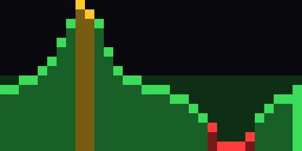

# PixelMug Glucose VU-meter 🩸☕

Turn a **PixelMug P1** (32×16 LED mug) into a live blood-glucose VU-meter. It reads
[Dexcom Share](https://www.dexcom.com/) in real time, renders the last **6 hours** of glucose
as a tiny 32×16 GIF, and displays it on the mug via a [Bubble](https://github.com/bubble-im) bot.

<p align="center">
  <br>
  <em>Preview (upscaled 16× for the eye — the mug renders the real 32×16). Yellow = high,
  green = in range, red = low, dim-green band = target 4–8 mmol, brightest column = now.</em>
</p>

> Status: **working prototype**. The render pipeline is verified end-to-end (valid 32×16
> GIF89a, ~200 bytes, well under the 40 KB cap). Pushing to a physical mug needs two things
> that aren't code: a **bot token** and a **public URL** to host the GIF (see below).

## How it works

```
Dexcom Share ──6h series──▶ render (32×16 GIF) ──▶ publish (public URL) ──▶ Bubble bot ──talPlayGif──▶ PixelMug P1
     every 5 min                 ≤40 KB, GIF89a         out/ + host                 (runs on your box)
```

The mug's firmware is intentionally minimal: a bot (this repo) runs on your own machine,
talks to the Bubble platform with a **bot token**, and sends the device an RPC (`talPlayGif`)
pointing at a GIF URL. The mug downloads and displays it. Control/config happens from the
Bubble chat via an inline keyboard (refresh, bars/spark style, discreet mode, read cup
temperature, battery, clear).

### Confirmed PixelMug P1 facts (from the [bubble-im](https://github.com/bubble-im) SDK)
- Image path: `talPlayGif({ gifContent: { size, type, url } })` — GIF **must be exactly 32×16,
  ≤ 40 KB, GIF87a/89a, at a public URL**.
- Temperature: `talGetCupTemperature()` (poll — there is no temp push).
- Also available: battery, wifi, brightness, display on/off, `talReturn2Home` (clear),
  charging-state notifications.
- P1 is an explicitly supported device; the display is 32×16.

## Quick start

```bash
bun install          # deps (gifenc)
bun run setup        # fetch the third-party Bubble SDK into ./sdk (not committed)
bun run dryrun       # render sample + live GIFs to ./out and validate them — NO mug/token needed
```

`dryrun` uses synthetic curves out of the box. Drop real Dexcom creds into `.env` and it
renders your live glucose instead.

```bash
bun test             # 20 tests: mug-GIF constraints, colour zones, stale handling, trend
```

### Hosting the GIF (so the mug can fetch it)

```bash
bun run serve                                   # serve ./out on :8787
cloudflared tunnel --url http://localhost:8787  # -> public URL for GIF_PUBLIC_BASE_URL
```

See [HOSTING.md](HOSTING.md) for tailscale-funnel and bucket options.

### Running against a real mug

```bash
cp .env.example .env # fill in BOT_TOKEN, Dexcom creds, GIF_PUBLIC_BASE_URL
bun run bot
```

Then open the bot's chat in the Bubble app, attach your PixelMug, and send `/start`.

## The two things still needed (not code)

1. **Bot token** — apply for one via the Bubble / PixelMug developer program. It authorizes
   this bot on the platform.
2. **Public GIF hosting** — the mug fetches the GIF over the internet, so `./out` must be
   reachable at `GIF_PUBLIC_BASE_URL`. Options: a small bucket (Cloudflare R2 / S3) you sync
   `./out` to, a static host, or a tunnel (cloudflared / tailscale funnel) to this machine.
   `src/hosting.ts` is the single place to swap in a direct bucket upload.

## Project layout

| File | Purpose |
|---|---|
| `src/render.ts` | glucose series → 32×16 indexed frame → GIF (gifenc); `assertMugGif` validates the constraints |
| `src/dexcom.ts` | Dexcom Share client (EU/US), session cache, least-squares trend |
| `src/hosting.ts` | write GIF to `./out` and build the public URL the mug downloads |
| `src/glucoseBot.ts` | the Bubble bot: `/start`, inline keyboard, 5-min push loop, temp/battery reads |
| `src/dryrun.ts` | run & verify the whole pipeline with no mug or token |
| `src/synthetic.ts` | realistic fake curves for demos/tests |
| `sdk/` | third-party Bubble SDK, fetched by `bun run setup` (gitignored) |

## Design notes
- **Fixed y-scale 3–13 mmol → 16 rows** so the same bar height always means the same value.
- Colour zones match GlukosRun: red ≤ 4.5, green ≤ 12.5, yellow above.
- **Stale > 16 min → gray**, never green — an old value must never look fresh and healthy.
- Trend uses a least-squares slope over the last 20 min, not Dexcom's arrow (which lags real
  falls).
- Low glucose renders a slow 2-frame blink on the newest column.

## Security
- No secrets in the repo: `.env` is gitignored; credentials come from env only.
- The third-party SDK is fetched at setup time, not redistributed here.

---
Built for a PixelMug P1. Not affiliated with PixelMug / jeejio or Dexcom. Not a medical device.
