# PixelMug Glucose Face 🤪🩸

> **`face-emoji` branch** — an alternate build with **no text and no graph**. The mug shows a
> single animated "NOT-man"-style face whose **expression is your blood glucose**.
> (The `main` branch is the VU-meter graph version.)

It reads [Dexcom Share](https://www.dexcom.com/) in real time, decides how it feels, and displays
the matching animated 32×16 face on the mug via a [Bubble](https://github.com/bubble-im) bot.

<p align="center">
  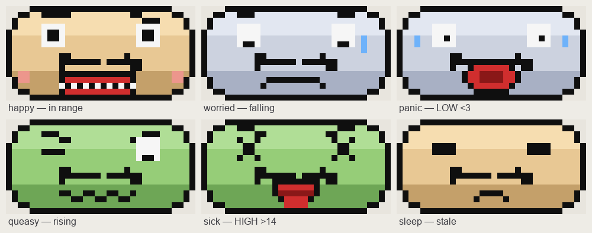<br>
  <em>The built-in faces (upscaled — the mug renders the real 32×16 on light ceramic). The head
  fills the canvas, with a dark outline, shaded skin tones and an animated mouth per mood.</em>
</p>

## What the face means

| | Face | Shown when | Animation |
|---|---|---|---|
|  | **happy** | glucose **in range** (3–14) and no warning | talks (grin opens/closes), blinks, pink cheeks |
|  | **worried** | **falling** — 20-min projection **≤ 3** | pale, brows up, frown quivers, sweat drips down |
|  | **panic** | **low, ≤ 3.0** | pale, wide eyes, red mouth screams (pulses), sweats & shakes |
|  | **queasy** | **rising** — 20-min projection **≥ 14** | green, woozy eyes, wavy mouth ripples |
|  | **sick** | **high, ≥ 14.0** | green, X eyes, tongue lolls in and out |
|  | **sleep** | reading **stale (> 16 min)** or no data | eyes closed, breathing, a snore bubble — never a "healthy" face on data it can't trust |

Skin colour is itself a signal: **tan = fine, pale = low, green = high**. The level (and the
20-minute prediction behind *worried* / *queasy*) comes from the same `assess()` logic as the
graph version on `main`; only the rendering differs.

## How it works

```
Dexcom Share ──6h──▶ assess level ──▶ render face (32×16 animated GIF) ──▶ publish ──▶ Bubble bot ──talPlayGif──▶ PixelMug P1
   every 5 min         alerts.ts            face.ts, ≤40 KB GIF89a          public URL           (runs on your box)
```

Each face is a small looping animation (talking mouth, blink, sweat drip, wobble, breathing)
built from a full-canvas rounded-rect head with a vertical skin gradient plus hand-drawn
eye/brow/moustache/mouth sprites. Every mug GIF is under ~1 KB — far below the 40 KB `talPlayGif` cap.

## Quick start

```bash
bun install          # deps (gifenc)
bun run setup        # fetch the third-party Bubble SDK into ./sdk (not committed)
bun run dryrun       # render every face to ./out (+ your live face if creds set) — NO mug/token needed
bun test             # 42 tests incl. face validity, level→expression, face-pack loading
```

`dryrun` uses synthetic data by default; drop real Dexcom creds into `.env` to see the face for
your live level.

### Hosting the GIF (so the mug can fetch it)

```bash
bun run serve                                   # serve ./out on :8787
cloudflared tunnel --url http://localhost:8787  # -> public URL for GIF_PUBLIC_BASE_URL
```

See [HOSTING.md](HOSTING.md) for tailscale-funnel and bucket options.

### Running against a real mug

```bash
cp .env.example .env # fill in BOT_TOKEN, Dexcom creds, GIF_PUBLIC_BASE_URL
bun run bot
```

Then open the bot's chat in the Bubble app, attach your PixelMug, and send `/start`.

## Making a face pack (swap the GIFs)

The faces are **swappable**. A *face pack* is just a folder with six GIFs — one per mood:

```
my-theme/
  happy.gif   worried.gif   panic.gif
  queasy.gif  sick.gif      sleep.gif
```

Each GIF must be **exactly 32×16, GIF87a/89a, ≤ 40 KB** (the mug's `talPlayGif` rules).
Animation is welcome — that's what the mug plays.

**1. Start from the built-in faces** (so you get correctly-sized files to edit):

```bash
bun run export-faces my-theme     # writes the 6 current faces into ./my-theme
```

**2. Edit or replace** each `my-theme/<mood>.gif` in any pixel / GIF editor — keep it 32×16.

**3. Use the pack** — point `FACE_PACK` at the folder (flag or in `.env`):

```bash
FACE_PACK=my-theme bun run dryrun   # validates every file, prints "pack" vs "built-in"
FACE_PACK=my-theme bun run bot      # run the mug with your pack
```

Good to know:
- **Any missing file falls back** to the built-in NOT-man face, so a partial pack is fine.
- `dryrun` checks each pack GIF and fails loudly if one breaks the 32×16 / ≤40 KB rules.
- Keep several folders (`zombie/`, `cat/`, `minimal/`, …) and switch by changing `FACE_PACK`.
- The pack only changes the **pictures**. Which mood maps to which glucose level lives in
  `expressionForLevel()` (`src/face.ts`) and the table above — that logic is unchanged.
- **Prefer to draw in code?** Edit the sprites in `src/face.ts` (head, eyes, brows, moustache,
  mouths) and re-run — no files needed.

### Included packs

Three ready-made packs ship in `packs/`. Point `FACE_PACK` at one (flag or `.env`):

```bash
FACE_PACK=packs/emoji bun run bot     # or packs/pacman, packs/snobben
```

**Emoji** 🙂 — `packs/emoji` — the colour reinforces the level (yellow → green when high).

<p align="center">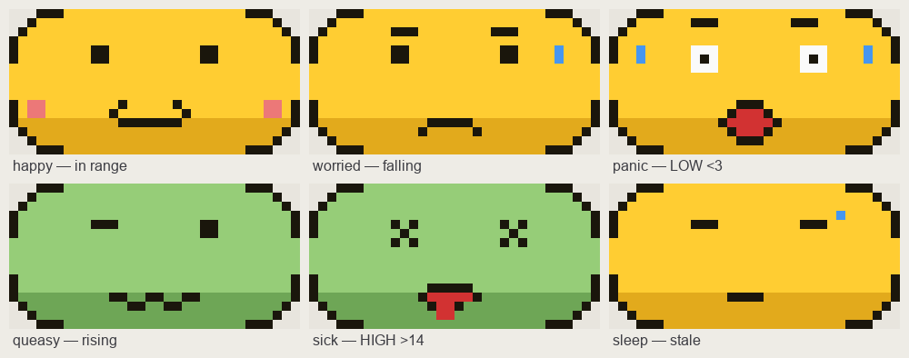</p>

**Pac-Man** 🟡 — `packs/pacman` — chomps pellets in range; a ghost closes in when you go low.

<p align="center">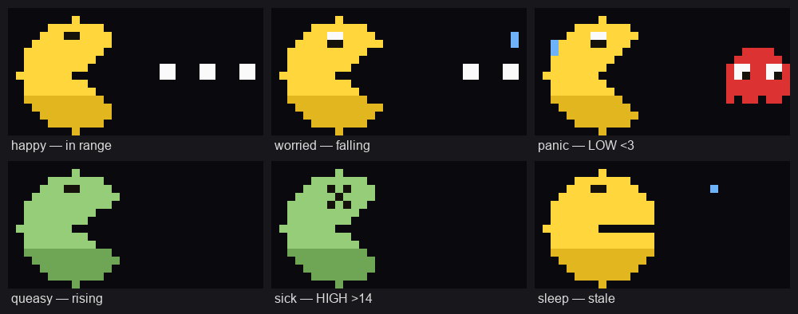</p>

**Snobben** 🐶 — `packs/snobben` — a Snoopy-style beagle with the floppy ear.

<p align="center"></p>

**Mumin** — `packs/mumin` — a Moomin *variety* pack: a different character per mood
(Moomintroll / Sniff / Little My / Hemulen / the Groke / Snufkin).

<p align="center">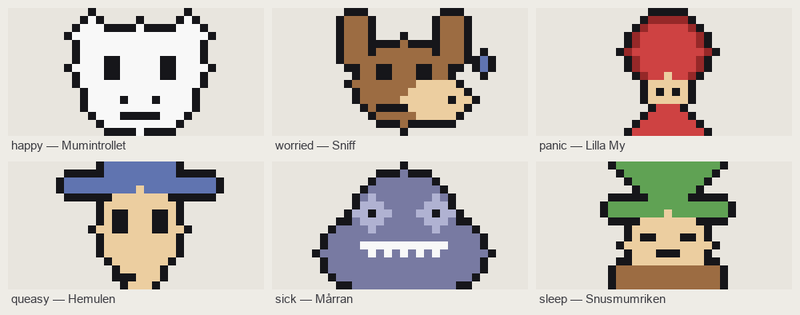</p>

**Väder — himmelen ÄR ditt glukos** 🌤️ — `packs/weather` — an ambient sky you can read across the
room, no numbers: ☀️ sun in range, 🌥️ clouds drift in as you fall, ⛈️ thunder + lightning when
you're low, ☁️ a churning grey lid as you climb, 🌨️ snowfall when you're high, 🌙 a calm night
when the reading is stale. Six frames each for smooth motion. Generate with `bun run gen-weather`
(and `THEME=dark bun run gen-weather` for the black S1 Pro).

<p align="center">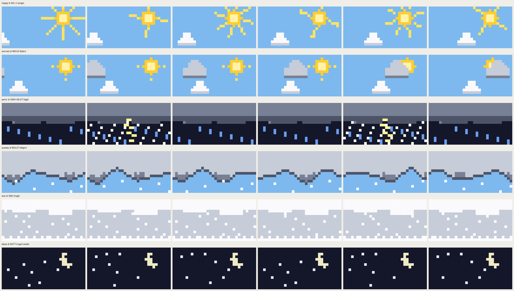</p>

**Lägereld — lågan ÄR ditt glukos** 🔥 — `packs/fire` — a campfire that breathes calmly in range,
🔥 grows and turns orange as you climb, 🔥🔥 roars into a spark-throwing blaze when you're high,
🔥 shrinks and dims as you fall, 🌡️ gutters down to glowing embers + rising smoke when you're low,
and 🪵 goes to a cold hearth with one last coal when the reading is stale. Real flicker, six frames.
Generate with `bun run gen-fire` (and `THEME=dark bun run gen-fire` for the black S1 Pro).

<p align="center">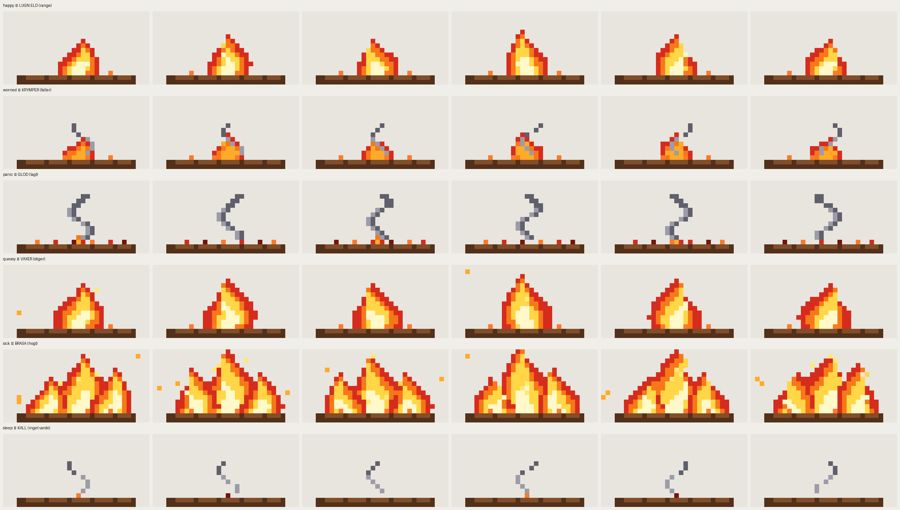</p>

**Akvarium — fisken ÄR ditt glukos** 🐟 — `packs/aqua` — a goldfish drifting calmly to and fro in
range, 🐟 sinking as you fall, 🐟 climbing toward the surface as you rise, 🐟 gasping in a murky warm
tank when you're high, darting a frantic red along the bottom when you're low, and 🌙 resting on the
sand when the reading is stale. Swaying weeds, rising bubbles, six frames each. Generate with
`bun run gen-aqua` (and `THEME=dark bun run gen-aqua` for the black S1 Pro).

<p align="center">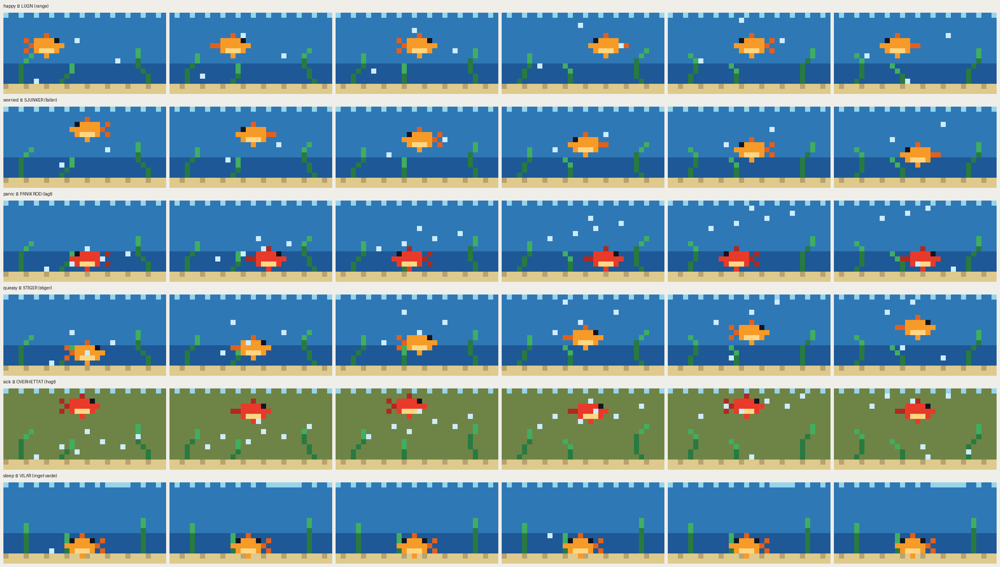</p>

**Lavalampa** 🌋 — `packs/lava` — molten metaball blobs: green bob in range, sink and cool to blue as
you fall/are low, boil red-hot up top when you're high. Colour + height + motion all track glucose.

<p align="center">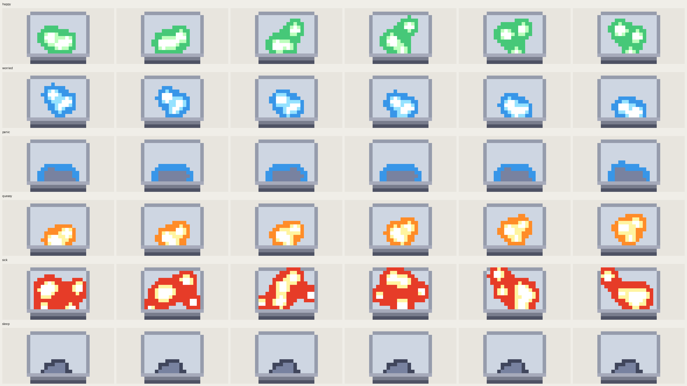</p>

**Matrix** 🟩 — `packs/matrix` — digital rain: green and steady in range, blue and glitchy when low,
amber climbing, red and racing when high, a dim idle drizzle when stale.

<p align="center">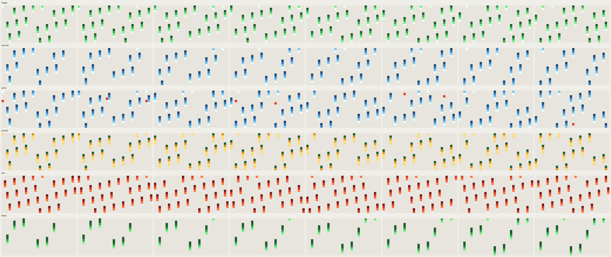</p>

**Rymd** 🌌 — `packs/space` — a starfield past a little ringed planet: stars drift up as you rise,
down as you fall, gently twinkle in range, blaze into a red warp when high / cold-blue warp when low.

<p align="center">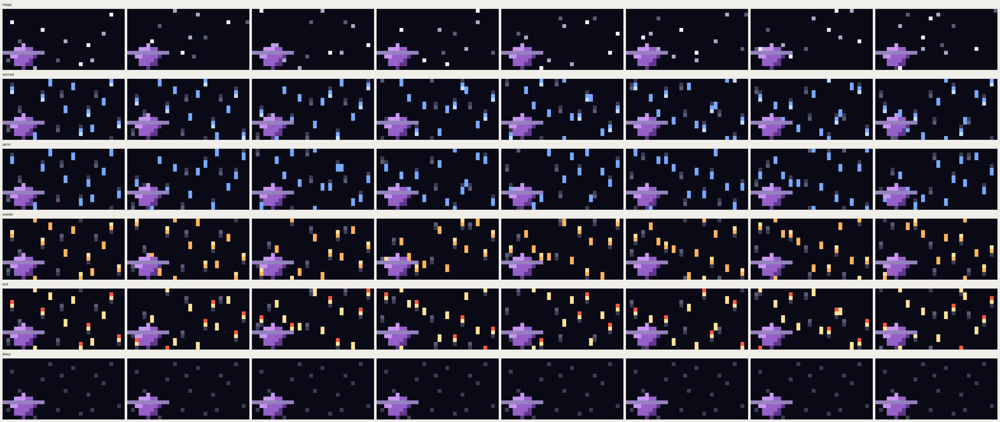</p>

**Synthwave** 🌇 — `packs/synth` — a retro sun over a neon perspective grid: it rides high and hot-red
when you're high, sits mid and warm in range, sinks and cools as you fall/are low, night when stale.

<p align="center">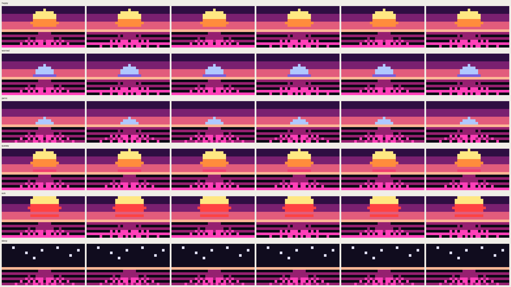</p>

Each is generated by its script (`bun run gen-emoji` / `gen-pacman` / `gen-snobben` / `gen-weather` / `gen-fire` / `gen-aqua` / `gen-lava` / `gen-matrix` / `gen-space` / `gen-synth`) — edit the
matching `src/gen-*.ts` to tweak. Original pixel art — playful homages, not the real characters;
for personal use on your own mug.

### Designing for the LED — and previewing on the mug

The mug shows the pixels you send, on **light ceramic**. So design on a **light background**
(index 0 = a ceramic tone), and make figures read against it:

- A **white/pale shape needs a dark outline** or it disappears into the ceramic — Snobben has a
  black outline plus a black ear and nose.
- **Black and bright saturated colours** (yellow, green, red) read well on the light ceramic;
  pale/light colours wash out.

Preview any pack GIF as it'll look on the device — the mockup is an **animated GIF** of the mug
playing the animation:

```bash
python3 scripts/mug_mockup.py packs/snobben/happy.gif docs/mug.gif
```

<p align="center">
  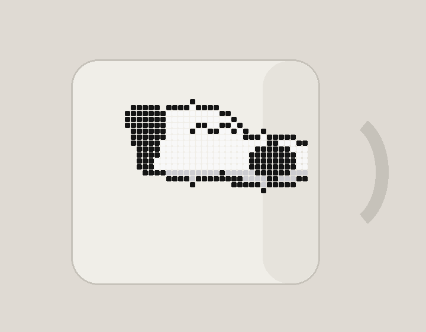
  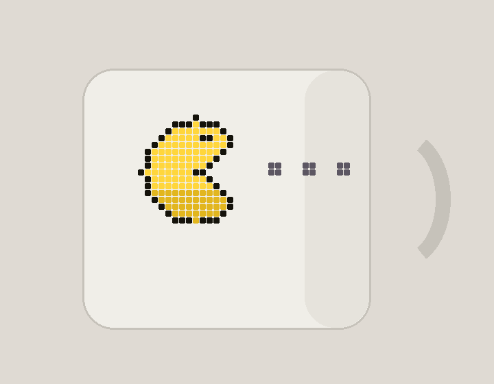
</p>

## Run on the phone (Android app)

`android/` is a native Kotlin app that runs the whole loop **on your phone** — no PC, no tunnel.
Every 5 min it fetches Dexcom, picks the expression, and pushes the matching pack GIF to the mug
via the Bubble bot API (a foreground service).

```bash
cd android
./gradlew :app:assembleDebug
adb install -r app/build/outputs/apk/debug/app-debug.apk
```

In the app: enter your **bot token** + **Dexcom** login, tap **Koppla mugg** (open the Bubble app
and send `/start` so it can capture the chat), then **Starta**. `Testa push` fires one update.

Three **modes**:
- **Ansikte** — one of the static packs (fetched from the GIF base URL). Pick with a live preview.
- **Text** — native scrolling warnings via the mug's own font service (no hosting). The six
  warning texts are **editable** with `{v}` / `{arr}` / `{pred}` placeholders.
- **Graf** — the phone renders the 32×16 VU-meter GIF on-device (`Gif.kt` + `GraphRender.kt`) and
  uploads each frame to litterbox (temporary public URL) for the mug to fetch. No PC needed.

> The mug fetches each face from a **public URL** (`GIF base URL` → `<base>/packs/<pack>/<expr>.gif`).
> The six GIFs per pack are static, so host them once anywhere public — e.g. make this repo public
> and use the jsDelivr default (`https://cdn.jsdelivr.net/gh/<user>/pixelmug-glucose-bot@face-emoji`),
> or point the base URL at any static host / bucket.

## Project layout

| File | Purpose |
|---|---|
| `src/face.ts` | the animated 32×16 built-in face — head, expression sprites, `renderFaceGif` |
| `src/facepack.ts` | picks the GIF per mood: a `FACE_PACK` folder if set, else built-in |
| `src/export-faces.ts` | `bun run export-faces <dir>` — dump the built-in faces as editable GIFs |
| `src/gen-*.ts` (emoji · pacman · snobben · mumin) | generators for the bundled packs |
| `packs/` | ready-made face packs: `emoji/`, `pacman/`, `snobben/`, `mumin/` — pick via `FACE_PACK` |
| `src/alerts.ts` | level + 20-min prediction (`assess`) that picks the expression |
| `src/dexcom.ts` | Dexcom Share client (EU/US), session cache, least-squares trend |
| `src/hosting.ts` | write GIF to `./out` and build the public URL the mug downloads |
| `src/glucoseBot.ts` | the Bubble bot: `/start`, refresh/temp/battery, 5-min push loop |
| `src/render.ts` | (from main) still provides `assertMugGif` — the GIF constraint validator |
| `src/dryrun.ts` | render & validate every face with no mug or token |
| `sdk/` | third-party Bubble SDK, fetched by `bun run setup` (gitignored) |

## Design notes
- The head fills the whole 32×16 (rounded-rect, no empty rows), so features get maximum room.
- Skin uses three shades (highlight / base / jaw-shadow) per tone for a bit of depth; the
  mouth has a dark-red interior; happy gets pink cheeks.
- Each mood has an **animated mouth** (talk / scream-pulse / quiver / ripple / tongue / breathe)
  plus expressive eyebrows and a crooked NOT-man moustache.
- Thresholds are env-configurable (`LOW_URGENT`, `HIGH_URGENT`, `PRED_WINDOW_MIN`); the
  prediction is `current + least-squares slope × window`, not Dexcom's laggy arrow.
- **Stale > 16 min → asleep**, never a "healthy" face — an old value must not look reassuring.
- Skin colour is itself a signal: tan = fine, pale = low, green = high.

## Security
- No secrets in the repo: `.env` is gitignored; credentials come from env only.
- The third-party SDK is fetched at setup time, not redistributed here.

---
Built for a PixelMug P1. A playful nod to the Anthrax "NOT-man" — not affiliated with Anthrax,
PixelMug / jeejio, or Dexcom. Not a medical device.
