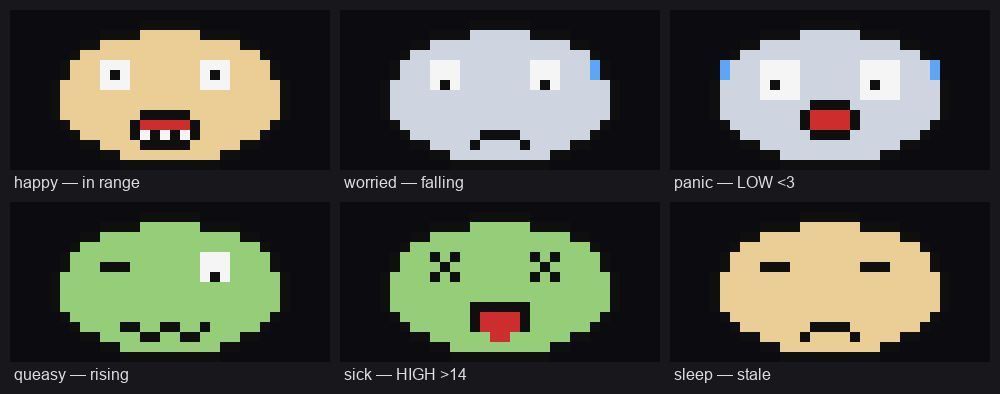
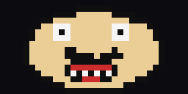
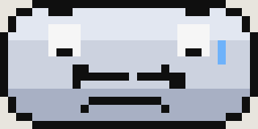
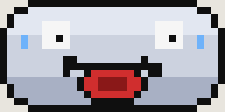
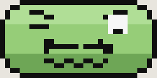
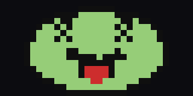
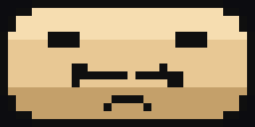
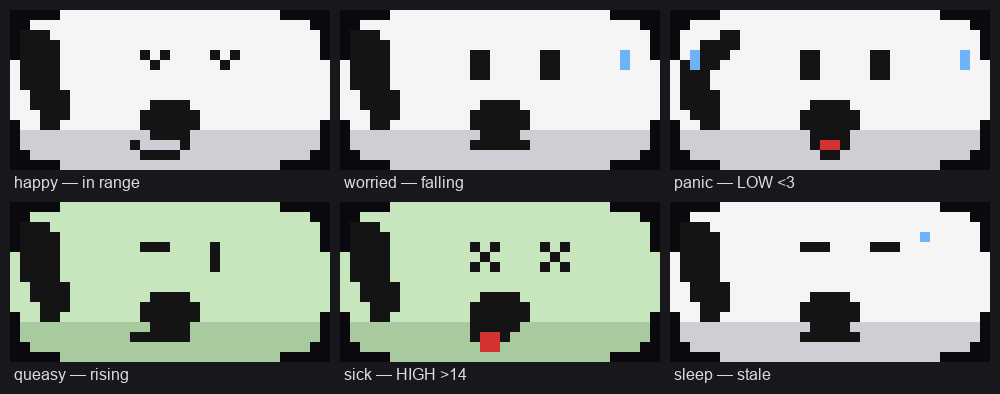

# PixelMug Glucose Face 🤪🩸

> **`face-emoji` branch** — an alternate build with **no text and no graph**. The mug shows a
> single animated "NOT-man"-style face whose **expression is your blood glucose**.
> (The `main` branch is the VU-meter graph version.)

It reads [Dexcom Share](https://www.dexcom.com/) in real time, decides how it feels, and displays
the matching animated 32×16 face on the mug via a [Bubble](https://github.com/bubble-im) bot.

<p align="center">
  <br>
  <em>The faces (upscaled — the mug renders the real 32×16). The head fills the whole canvas
  edge-to-edge, with shaded skin tones and an animated mouth per mood.</em>
</p>

## What the face means

| | Face | Shown when | Animation |
|---|---|---|---|
|  | **happy** | glucose **in range** (3–14) and no warning | talks (grin opens/closes), blinks, pink cheeks |
|  | **worried** | **falling** — 20-min projection **≤ 3** | pale, brows up, frown quivers, sweat drips down |
|  | **panic** | **low, ≤ 3.0** | pale, wide eyes, red mouth screams (pulses), sweats & shakes |
|  | **queasy** | **rising** — 20-min projection **≥ 14** | green, woozy eyes, wavy mouth ripples |
|  | **sick** | **high, ≥ 14.0** | green, X eyes, tongue lolls in and out |
|  | **sleep** | reading **stale (> 16 min)** or no data | eyes closed, breathing, a snore bubble — never a "healthy" face on data it can't trust |

Skin colour is itself a signal: **tan = fine, pale = low, green = high**. The level (and the
20-minute prediction behind *worried* / *queasy*) comes from the same `assess()` logic as the
graph version on `main`; only the rendering differs.

## How it works

```
Dexcom Share ──6h──▶ assess level ──▶ render face (32×16 animated GIF) ──▶ publish ──▶ Bubble bot ──talPlayGif──▶ PixelMug P1
   every 5 min         alerts.ts            face.ts, ≤40 KB GIF89a          public URL           (runs on your box)
```

Each face is a small looping animation (talking mouth, blink, sweat drip, wobble, breathing)
built from a full-canvas rounded-rect head with a vertical skin gradient plus hand-drawn
eye/brow/moustache/mouth sprites. Every mug GIF is under ~1 KB — far below the 40 KB `talPlayGif` cap.

## Quick start

```bash
bun install          # deps (gifenc)
bun run setup        # fetch the third-party Bubble SDK into ./sdk (not committed)
bun run dryrun       # render every face to ./out (+ your live face if creds set) — NO mug/token needed
bun test             # 42 tests incl. face validity, level→expression, face-pack loading
```

`dryrun` uses synthetic data by default; drop real Dexcom creds into `.env` to see the face for
your live level.

### Hosting the GIF (so the mug can fetch it)

```bash
bun run serve                                   # serve ./out on :8787
cloudflared tunnel --url http://localhost:8787  # -> public URL for GIF_PUBLIC_BASE_URL
```

See [HOSTING.md](HOSTING.md) for tailscale-funnel and bucket options.

### Running against a real mug

```bash
cp .env.example .env # fill in BOT_TOKEN, Dexcom creds, GIF_PUBLIC_BASE_URL
bun run bot
```

Then open the bot's chat in the Bubble app, attach your PixelMug, and send `/start`.

## Making a face pack (swap the GIFs)

The faces are **swappable**. A *face pack* is just a folder with six GIFs — one per mood:

```
my-theme/
  happy.gif   worried.gif   panic.gif
  queasy.gif  sick.gif      sleep.gif
```

Each GIF must be **exactly 32×16, GIF87a/89a, ≤ 40 KB** (the mug's `talPlayGif` rules).
Animation is welcome — that's what the mug plays.

**1. Start from the built-in faces** (so you get correctly-sized files to edit):

```bash
bun run export-faces my-theme     # writes the 6 current faces into ./my-theme
```

**2. Edit or replace** each `my-theme/<mood>.gif` in any pixel / GIF editor — keep it 32×16.

**3. Use the pack** — point `FACE_PACK` at the folder (flag or in `.env`):

```bash
FACE_PACK=my-theme bun run dryrun   # validates every file, prints "pack" vs "built-in"
FACE_PACK=my-theme bun run bot      # run the mug with your pack
```

Good to know:
- **Any missing file falls back** to the built-in NOT-man face, so a partial pack is fine.
- `dryrun` checks each pack GIF and fails loudly if one breaks the 32×16 / ≤40 KB rules.
- Keep several folders (`zombie/`, `cat/`, `minimal/`, …) and switch by changing `FACE_PACK`.
- The pack only changes the **pictures**. Which mood maps to which glucose level lives in
  `expressionForLevel()` (`src/face.ts`) and the table above — that logic is unchanged.
- **Prefer to draw in code?** Edit the sprites in `src/face.ts` (head, eyes, brows, moustache,
  mouths) and re-run — no files needed.

### Included pack: "Snobben" 🐶

A ready-made beagle pack (Snoopy-style) ships in `packs/snobben/`:

<p align="center">
  
</p>

```bash
FACE_PACK=packs/snobben bun run dryrun   # preview / validate
FACE_PACK=packs/snobben bun run bot      # run the mug with the beagle
```

It's generated by `bun run gen-snobben` (edit `src/gen-snobben.ts` to tweak it). Original pixel
art — a playful homage, not the real character; for personal use on your own mug.

## Project layout

| File | Purpose |
|---|---|
| `src/face.ts` | the animated 32×16 built-in face — head, expression sprites, `renderFaceGif` |
| `src/facepack.ts` | picks the GIF per mood: a `FACE_PACK` folder if set, else built-in |
| `src/export-faces.ts` | `bun run export-faces <dir>` — dump the built-in faces as editable GIFs |
| `src/gen-snobben.ts` | `bun run gen-snobben` — generate the bundled beagle pack in `packs/snobben/` |
| `packs/snobben/` | ready-made beagle (Snoopy-style) face pack — `FACE_PACK=packs/snobben` |
| `src/alerts.ts` | level + 20-min prediction (`assess`) that picks the expression |
| `src/dexcom.ts` | Dexcom Share client (EU/US), session cache, least-squares trend |
| `src/hosting.ts` | write GIF to `./out` and build the public URL the mug downloads |
| `src/glucoseBot.ts` | the Bubble bot: `/start`, refresh/temp/battery, 5-min push loop |
| `src/render.ts` | (from main) still provides `assertMugGif` — the GIF constraint validator |
| `src/dryrun.ts` | render & validate every face with no mug or token |
| `sdk/` | third-party Bubble SDK, fetched by `bun run setup` (gitignored) |

## Design notes
- The head fills the whole 32×16 (rounded-rect, no empty rows), so features get maximum room.
- Skin uses three shades (highlight / base / jaw-shadow) per tone for a bit of depth; the
  mouth has a dark-red interior; happy gets pink cheeks.
- Each mood has an **animated mouth** (talk / scream-pulse / quiver / ripple / tongue / breathe)
  plus expressive eyebrows and a crooked NOT-man moustache.
- Thresholds are env-configurable (`LOW_URGENT`, `HIGH_URGENT`, `PRED_WINDOW_MIN`); the
  prediction is `current + least-squares slope × window`, not Dexcom's laggy arrow.
- **Stale > 16 min → asleep**, never a "healthy" face — an old value must not look reassuring.
- Skin colour is itself a signal: tan = fine, pale = low, green = high.

## Security
- No secrets in the repo: `.env` is gitignored; credentials come from env only.
- The third-party SDK is fetched at setup time, not redistributed here.

---
Built for a PixelMug P1. A playful nod to the Anthrax "NOT-man" — not affiliated with Anthrax,
PixelMug / jeejio, or Dexcom. Not a medical device.
